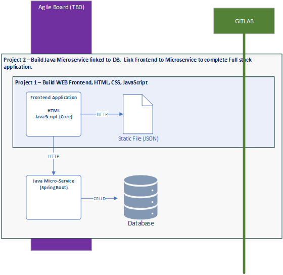

# Project 1 WEB Frontend Reference Design & Implementation 

**&larr; [Back to Program README](../README.md)**
<!-- TOC -->
- [Project 1 WEB Frontend Reference Design \& Implementation](#project-1-web-frontend-reference-design--implementation)
  - [Introduction](#introduction)
  - [Tasks](#tasks)
<!-- TOC -->

---

* [Components and Navigation](./docs/components.md)
* [Development Environment & Setup](./docs/development-environment.md)
* [API Design](./docs/endpoints.md)
* [Patterns](./docs/patterns.md)
* [Generated React README](docs/components.md)

---

## Introduction

Project 1, 2, 3 forms the application part of the Estate Agent Management case study. Project 1 consist of the user interface made up of <b>HTML</b>, <b>CSS</b> , <b>JavaScript</b> and <b>React</b> as shown in Fig 1.  This section describes the Reference Design & Implementation for Project 1 that supports a functional frontend.

This reference design <b>may contain patterns and libraries that was not present in the WEB learning modules</b>.  This is deliberate to stretch your thinking beyond the modules materials.  The use of these  patterns and libraries are described as part of the reference document.

{width=500px}
<figcaption><b>Fig.1 - Project Boundaries </b></figcaption>

---
## Tasks

The following lists the tasks required for Project 1.

>**Feature: Register Seller**
>1. Data capture form for registering new Seller *Minimum Requirement
>2. Display Seller List  *Minimum Requirement

>**Feature: Manage Properties**
>1. Data capture form for registering new properties  *Minimum Requirement
>2. Search and Display all properties  *Minimum Requirement
>3. Withdraw a property
>4. Resubmit a property
>5. Change property status from FORSALE to "SOLD"  

>**Feature: Register Buyer**
>1. Data capture form for registering new Buyer *Minimum Requirement
>2. Display Buyer List *Minimum Requirement 

>**Feature: Manage Booking**
>1. Make a new booking
>2. List bookings for a property
