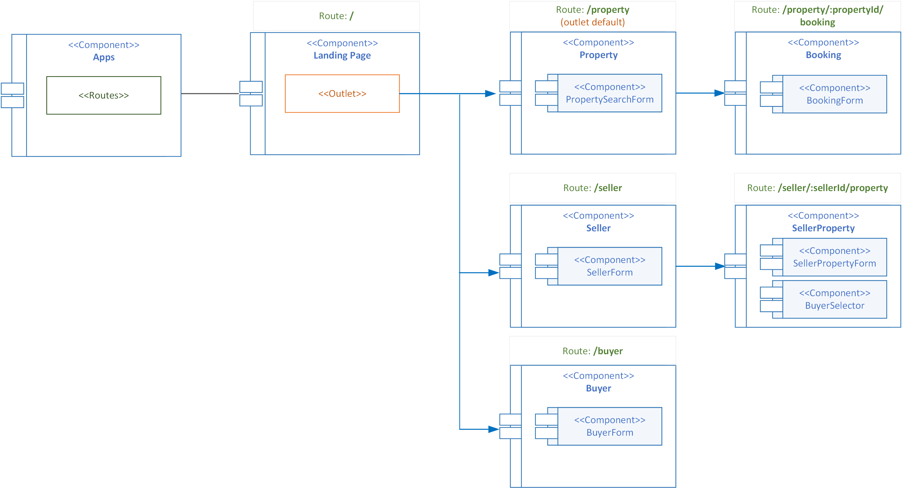

**&larr; [Back to Project 1 README](../README.md)**
# Components and Navigation

* [Components and Navigation](#components-and-navigation)
  * [App](#app)
  * [LandingPage](#landingpage)
  * [Property](#property)
  * [Booking](#booking)
  * [Seller](#seller)
  * [SellerProperty](#sellerproperty)
  * [Buyer](#buyer)

---


<figcaption><b>Fig.1 - React Components</b></figcaption>

## App
App is the **root** component. It holds the Route Definitions as shown below, but it is not navigable itself. 

```html
<Route path="/" element={<LandingPage/>}> /*This is the root path*/
    <Route index element={<Property/>}/> /*This is the default component shown in the <Outlet> tag */
    <Route path="property" element={<Property/>}/>
    <Route path="seller" element={<Seller/>}/>
    <Route path="seller/:sellerId/property" element={<SellerProperty/>}/>
    <Route path="buyer" element={<Buyer/>}/>
    <Route path="property/:propertyId/booking" element={<Booking/>}/>
</Route>
```

## LandingPage 
>Route: **/**

The LandingPage component is the topmost navigable component. It holds the React Router **Outlet** Component where other components content are rendered. It also hosts a navigation bar.  

## Property
>Route: **/property**

The Property component retrieves and display all properties from the backend RESTFUL services.   It contains the **PropertySearchForm** subcomponent which allows filtering of the properties list.  The **Booking** component is navigable from here for each property that has a FORSALE status.  The selected property object is passed to Booking component via the **state** attribute of <**Link**>

```html
<Link to={`/property/${property.id}/booking`} state={property}>
```

## Booking
>Route: **/property/:propertyId/booking**

The Booking component allows bookings to be made for the property passed in from the Property component.  The property details is passed via the Link componment's  **state** attribute and is retried from the location object via the **useLocation** hook as shown: 

```javascript
const property = useLocation().state;
```
The **:propertyId** parameter passed via the route is not really needed as this information is already present in the property object but the present of propertyId makes the route compliance with RESTful API convention.  For completion, the following shows how to extract the propertyId using the useParams hook.
```javascript
const {propertyID} = useParams();
```
The Booking component has within the BookingForm subcomponent which allows booking.  Since a Booking requires a Buyer, all the Buyers are loaded at the start via useEffect() and presented as a dropdown list in BookingForm.

## Seller
>Route: **/seller

The seller components lists all the sellers and allows registering new seller via the **SellerForm** subcomponent.  It loads all the sellers from backend via useEffects() and are stored via useReducer().

The **SellerProperty** component is navigated from here for the selected seller using < **Link** > and the seller object is passed via the Link component's **state** attribute.

## SellerProperty
The SellerPropetry components is where new propperties can be added using the **SellerPropertyForm** subcomponent.  A property is always to a seller.  This component also allows the the updating a property status.  Updating property status to SOLD will also requires a Buyer information which provided via the **BuyerSelector** subcomponent which is implemented as a modal list.

## Buyer
>Route: **/buyer

The buyer components lists all the sellers and allows registering new seller via the **BuyerForm** subcomponent.  It loads all the sellers from backend via useEffects() and are stored via useReducer().
