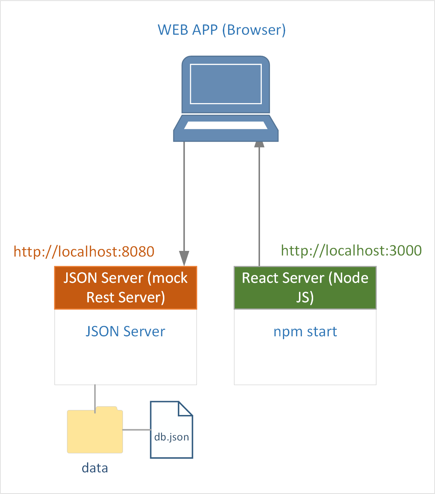

**&larr; [Back to Project 1 README](../README.md)**
# Development Environment and Setup

 * [Creating the React Project](#creating-the-react-project)
 * [JSON Server Setup](#json-server-setup)
   * [Starting the JSON Server](#starting-the-json-server)

---
## Creating the React Project
As a reminder, you can use the following to create skeleton project:
<pre style="background: #004050; color: lightgreen; font-size: larger">
    npx create-react-app estate-agent
</pre>

## JSON Server Setup
The target architecture consist of a frontend application serves from a NodeJS server and with data from a Java Microservice. It is necessary to employ a mock backend to facilitate the development of the development of Project 1 as the Java Microservice will not be available until the completion of Project 3.  As such, JSONServer (https://www.npmjs.com/package/json-server) backend will be used as the mock backend.

{width=500px}
<figcaption><b>Fig.2 - Development Environment</b></figcaption>

 

><mark>**Note**</mark>
>
>- the reference code hardcode the backend URL to **http://localshot:8080**.  This matches the SpringBoot microservice listening port.  This avoids needing to change the URL when developing Project 3.
>- It is possible to use React profiles for managing production and development profiles to avoid hard coding but this out of scope for this project.

### Starting the JSON Server
<pre style="background: #004050; color: lightgreen; font-size: larger">
    npx json-server --watch data\db.json --port 8080
</pre>

This will create a db.json file in the data directory.  It is important to place the data directory outside your React project directory otherwise the React server will reload your page everytime the db.json changes.
