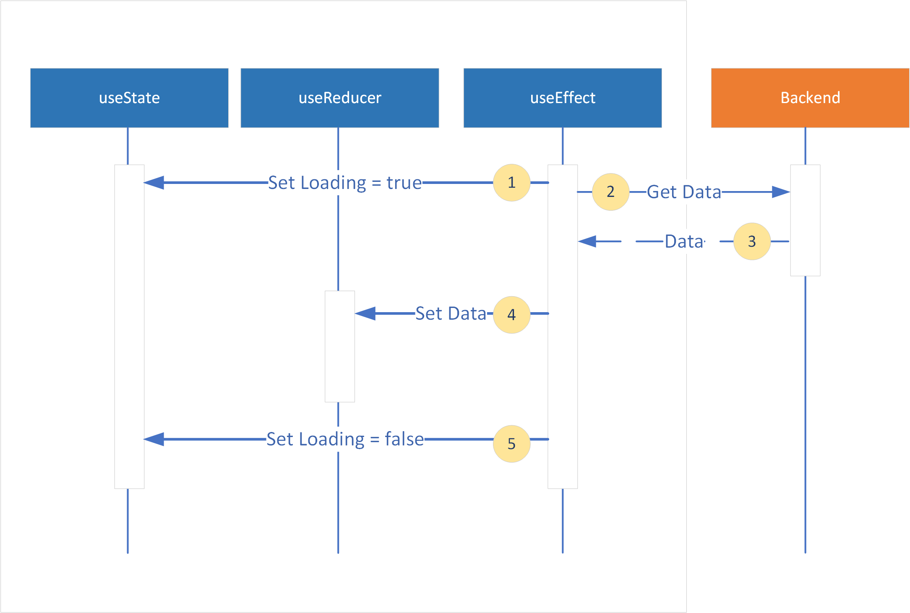
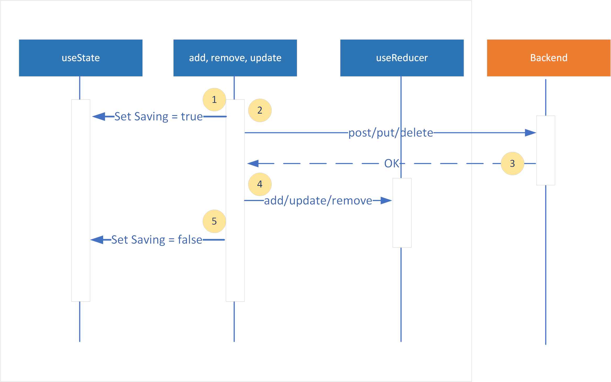

**&larr; [Back to Project 1 README](../README.md)**
# Design Patterns

  * [Loading and Saving Status](#loading-and-saving-status)
  * [No Record Status !](#no-record-status-)
  * [Form Submission and Validation](#form-submission-and-validation)
  * [Passing an object as prop in React-router Link](#passing-an-object-as-prop-in-react-router-link)
---

## Loading and Saving Status
Showing saving and loading status messages provides important feedback to the user and improve the user experience.  REACT can accomplish this by reference a useState to indicate if it is loading  or saving as shown in Fig 1 and Fig 2.  A ternary (if then else) condition will then determine if the message is rendered based on the state as show below:
```jsx
{
    isLoading ?
        <div className="message alert alert-info" role="alert">
            <span className="spinner-border" role="status"><i className="sr-only"/></span>
            Loading
        </div>
        : ""
}
```
{width=800px}
<figcaption><b>Fig.1 - Loading Sequence </b></figcaption>

{width=800px}
<figcaption><b>Fig.2 - Add, Remove, Update Sequence</b></figcaption>

## No Record Status !
A ternary condition can be employed to test if the object, in this case an array, is empty or end before rendering.
```javascript
data.filter(data => [some-condition]).length === 0 && !loading ?
    <li>
        <div className="message alert alert-info" role="alert">
            <i className="bi bi-info-circle"></i>&nbsp;No Data Found
        </div>
    </li>
    :
    data => [some-condition])....
    // Loop through data
```

## Form Submission and Validation

The following shows an example how to check if a Form Field has error.   Again using a ternary condition to control if the error message or not.

```javascript
// This is the refernce to the form input element   
const firstNameRef = useRef();

// This indicates if the field has errors
const [firstNameError, setFirstNameError] = useState();

const handleSubmit = (e) => {
    // Prevent event from bubbling up, we will handle it here
    e.preventDefault();

    setFirstNameError(!firstNameRef.current.value); // set error to TRUE if empty
    
    if (firstNameError) {
        // stop the form from sending data to the backend 
        return ;
    }
    
    // send data to backend
}
```
```jsx
<div className="form-group col-md-6">
    <label htmlFor="sellerFirstName">First Name</label>
    <input type="text" className="form-control" id="sellerFirstName" ref={firstNameRef}/>
    {firstNameError ?
        <div className="text-danger"><i className="bi bi-exclamation-circle"/>First Name cannot be blank</div>
        : ""
    }
</div>
```

## Passing an object as prop in React-router Link
It is sometimes convenient and more optimal to pass objects directly to a component rather than have that component loading it from a backend.  However, this can be done directly when a component is inked via < link >.  Instead, objects can be passed to a **state** to < link > and the target component can retrieve this via the useLocation() hook. 

**From Component**
```html
<Link to={`/property/${property.id}/booking`} state={property}>
```
**Receiving Component**
```javascript
const property = useLocation().state;
```
