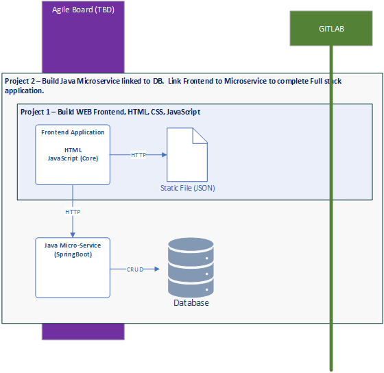
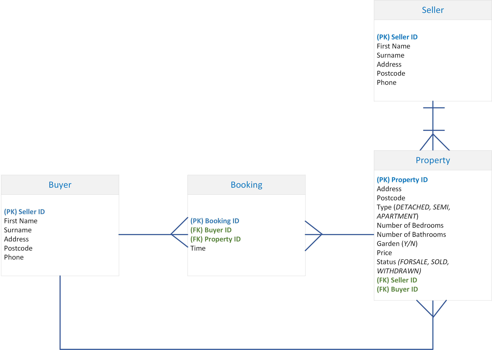

**&larr; [Back to Program README](../README.md)**
# Project 2 - Spring Microservice Reference Design & Implementation 

  - [Introduction](#introduction)
  - [Tasks](#tasks)
  - [Database Design](#database-design)

* [Development Environment & Setup](docs/development-environment.md)
* [API Design](docs/endpoints.md)
* [Application Archtecture](docs/architecture.md)
---

## Introduction

Project 2 is concerned with Java microservice in which you will need implement the <a href="docs/endpoints.md">REST API</a> as defined for Project 1.

{width=500px}
<figcaption><b>Fig.1 - Project Boundaries </b></figcaption>

---
## Tasks

The following lists the tasks required for Project 1,2

>**Feature: Register Seller**  
**Feature: Manage Properties**  
**Feature: Register Buyer**  
**Feature: Manage Booking**
> 
> - For each feature create the controller, DTO, mapping and entity for each domain : 
>   - Seller <mark>*Minimum Requirement<mark/>
>   - Buyer <mark>*Minimum Requirement<mark/>
>   - Property <mark>*Minimum Requirement<mark/>
>   - Booking *<mark>This is needed if you have implemented Booking in the frontend<mark/>
> - Create e2e tests 


## Database Design

You'll need to design the database schema for Estate Agent Application.  We can identify four domains from the case study requirements:

- SELLER
- PROPERTY
- BUYER
- BOOKING

### Database Schema

Figure 2 below shows the database schema after normalization:

{width=800px}
<figcaption><b>Fig.2 - Database Schema</b></figcaption>

### Database Script
```sql
# DROP database IF EXISTS projectDB;

# CREATE DATABASE IF NOT EXISTS projectDB;
#
# USE projectDB;

CREATE TABLE IF NOT EXISTS `SELLER` (
  `SELLER_ID` INT(11) NOT NULL AUTO_INCREMENT PRIMARY KEY,
  `FIRST_NAME` VARCHAR(255) NOT NULL,
  `SURNAME` VARCHAR(255) NOT NULL,
  `ADDRESS` VARCHAR(255) NOT NULL,
  `POSTCODE` VARCHAR(255) NOT NULL,
  `PHONE` VARCHAR(20) NOT NULL
);

CREATE TABLE IF NOT EXISTS `BUYER` (
  `BUYER_ID` INT(11) NOT NULL AUTO_INCREMENT PRIMARY KEY,
  `FIRST_NAME` VARCHAR(255) NOT NULL,
  `SURNAME` VARCHAR(255) NOT NULL,
  `ADDRESS` VARCHAR(255) NOT NULL,
  `POSTCODE` VARCHAR(255) NOT NULL,
  `PHONE` VARCHAR(20) NOT NULL
);

CREATE TABLE IF NOT EXISTS `PROPERTY` (
  `PROPERTY_ID` INT(11) NOT NULL AUTO_INCREMENT PRIMARY KEY,
  `ADDRESS` VARCHAR(255) NOT NULL,
  `POSTCODE` VARCHAR(255) NOT NULL,
  `TYPE` ENUM('DETACHED', 'SEMI', 'APARTMENT') NOT NULL,
  `NUMBER_OF_BEDROOMS` INT(3) NOT NULL,
  `NUMBER_OF_BATHROOMS` INT(3) NOT NULL,
  `GARDEN` BIT NOT NULL,
  `PRICE` DECIMAL(11,2),
  `STATUS` ENUM('FORSALE', 'SOLD', 'WITHDRAWN') NOT NULL,
  `SELLER_ID` INT NOT NULL,
  `BUYER_ID` INT,
  FOREIGN KEY (`SELLER_ID`) REFERENCES SELLER(SELLER_ID),
  FOREIGN KEY (`BUYER_ID`) REFERENCES BUYER(BUYER_ID)
);

CREATE TABLE IF NOT EXISTS `BOOKING` (
  `BOOKING_ID` INT NOT NULL AUTO_INCREMENT PRIMARY KEY,
  `BUYER_ID` INT NOT NULL,
  `PROPERTY_ID` INT NOT NULL,
  `TIME` TIMESTAMP,
  FOREIGN KEY (`BUYER_ID`) REFERENCES BUYER(BUYER_ID),
  FOREIGN KEY (`PROPERTY_ID`) REFERENCES PROPERTY(PROPERTY_ID)
);
```