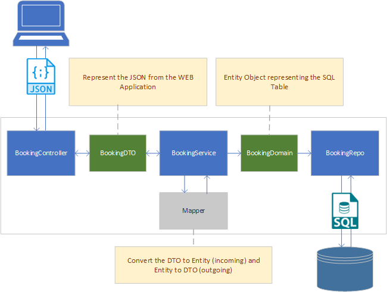

**&larr; [Back to Project 3 README](../README.md)**
# Architecture

<!-- TOC -->
  * [Overview](#overview)
  * [JSON <-> Entity Mapping](#json-----entity-mapping)
<!-- TOC -->
---
## Overview

The Java Microservice reference answer uses a layer architecture as shown in Fig 1.  The three layers are:
- presentation
- business
- persistence

{width=500px}
<figcaption><b>Fig.1 - Application Architecture </b></figcaption>

## JSON <-> Entity Mapping
Data are passed from in to the endpoints from the WEB application as JSON which is automatically converted to stated Java Objects by SpringBoot.  However, JSON structures represent the view from frontend perspective and does not necessary match the actual database represented by the Entity objects.  Therefore, it is necessary to covert or _**map**_between JSON and Entity.  While this can be done manually by writing your own class, the provided example here uses the ModelMapper library for this task.  This is demonstrated in the following code from the BookingService class:

```java
    @Autowired // saves us writing boilerplate to connect them
    public BookingService(BookingRepo repo, ModelMapper mapper) {
        this.repo = repo;
        this.mapper = mapper;
    }

    private BookingDTO mapToDto(BookingDomain model) {
        return this.mapper.map(model, BookingDTO.class);
    }
```
{width=500px}
<figcaption><b>Fig.2 - JSON <-> Entity Mapping </b></figcaption>
