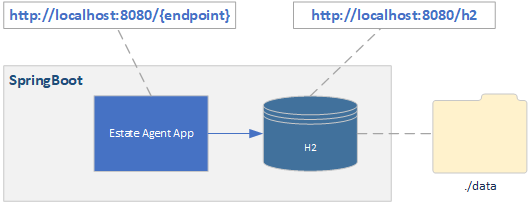
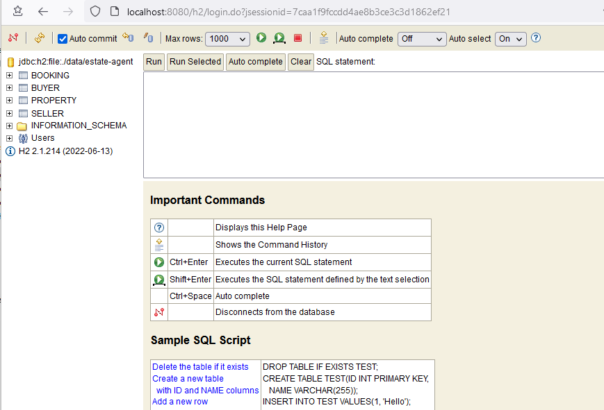

**&larr; [Back to Project 1 README](../README.md)**
# Development Environment and Setup

<!-- TOC -->
  * [Creating the Springboot Project](#creating-the-springboot-project)
  * [Using H2 as Embedded Database](#using-h2-as-embedded-database)
    * [Accessing the H2 console](#accessing-the-h2-console)
    * [mySQL Configuration Example](#mysql-configuration-example)
<!-- TOC -->

---
## Creating the Springboot Project
Create project via Spring Initalizr https://start.sprin.io

## Using H2 as Embedded Database

The full application requires a database for data storage.  The reference code uses an H2 database embedded for simplicity.  This H2 database is  configured to use MYSQL compatibility mode. It is also configured in the maven **_pom.xml_** to spin up as part of the Springboot application that requires no installation as shown below.  This will include the H2 database as part of the maven build  (e.g. mvn clean package) and will be included in the final application jar file.

```xml
<dependency>
    <groupId>com.h2database</groupId>
    <artifactId>h2</artifactId>
    <scope>runtime</scope>
</dependency>
```


<figcaption><b>Fig.1 - Embedded Database </b></figcaption>

The following shows the Spring configuration for h2 in _**application.properties**.  H2 is normally used as in memory database but is capable of persisting data to file by specify a file url  as the data sources.  The following specify that data file should be stored in the data directory in the location where application is started from.  Note also the additional parameters for MYSQL mode.

```properties
spring.datasource.url=jdbc:h2:file:./data/estate-agent;MODE=MYSQL;DB_CLOSE_ON_EXIT=FALSE
```

<mark>**Important**</mark>  This setup is unable to handle multiple instances required for HA deployment as each instance will have its own database.  When deploying to cloud in HA mode, you should use a cloud DB.

The following shows the complete DB configuration for application.properties 

```properties
Spring.jpa.database=mysql

spring.datasource.url=jdbc:h2:file:./data/estate-agent;MODE=MYSQL;DB_CLOSE_ON_EXIT=FALSE
spring.datasource.username=sa
spring.datasource.password=

# DB lives inside  our spring - creates the db from scratch!
spring.jpa.hibernate.ddl-auto=update

spring.jpa.generate-ddl=false
spring.sql.init.mode=always

spring.h2.console.enabled=true
spring.h2.console.path=/h2

spring.jpa.show-sql=true
```

### Accessing the H2 console

H2 includes a WEB console and can access via a browser using specified path. In this case the path is to **/h2**.  Using the default Springboot port the H2 console URL is http://localhost:8080/h2.  The JDBC URL in this case is _h2:file:./data/estate-agent_.
```properties
spring.h2.console.path=/h2
```

<figcaption><b>Fig.1 - h2 console </b></figcaption>


### mySQL Configuration Example

The following shows an example using an external mySQL DB.  For the cloud you will use the URL of the cloud DB.

```properties
spring.datasource.url=jdbc:mysql://localhost:3306/projectdb
spring.datasource.username=root
spring.datasource.password=root
```
